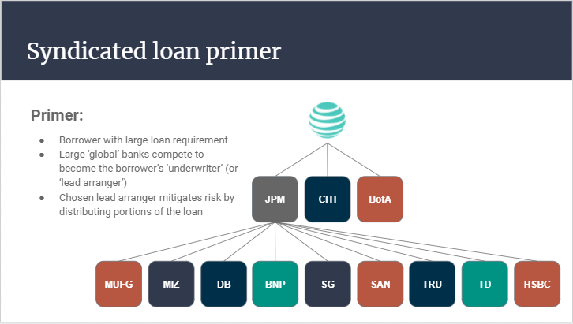

# Project 3: Loan Syndication Smart Contracts
### Replicating the loan syndication process using smart contracts on the Ethereum Blockchain

Code developed by Arthur Moran, Ben Fischler, Eli Holden, Nika Chan and Phil Waddilove

### Table of Contents
1. [Introduction](#Introduction)
2. [Reverse Auction Smart Contract to set the Borrower's Interest Rate](#auction)
    - a. [How syndicate managers are chosen today](#manager)
    - b. [Our solution: Reverse Auction](#reverseauction)
    - c. [Auction Contract Functions](#auctionfunctions)
3. [Crowdsale Smart Contract to distribute loan risk](#crowdsale)
    - a. [How risk distribution works today](#distribution)
    - b. [Our solution: Crowdsale](#crowdsalecontract)
    - c. [Crowdsale Contract Functions](#crowdsalefunctions)  
4. [Benefits of doing loan syndication on the Blockchain](#blockchain)
5. [Limitations and What can be Improved](#Conclusion)
6. [Considerations for Grading](#Grading)
7. [Contract Deployment Instructions](#instructions)
8. [Appendix](#Appendix)
9. [D-app Demo](#Demo)

&nbsp;

## 1. Introduction 
    
In this project, we replicated the loan syndication process using smart contracts built on the Ethereum blockchain. Loan syndication is the process of involving a group of lenders in funding various portions of a loan for a single borrower. It most often occurs when the borrower requires an amount that is too large for any single bank to provide. 

## 2. Reverse Auction Smart Contract to set the Borrower's Interest Rate 

### a. How Lead Arrangers are chosen today 

[Phil to write something here]

### b. Our solution: Reverse Auction 

Our solution is to replace the archaic process of calling and requesting for proposals from several banks. a Reverse Auction via smart contracts makes the process faster and more transparent. It also has the potential benefit of lowering the interest rate for the borrower. In this section of the smart contract, we are using the openzeppelin auction library to conduct an auction where banks bid for the loan by submitting an "interest rate bid", the winner of the auction is the bank that submits the lowest interest rate. Below is an example of a borrower with a large loan requirement going through the smart contract.

### c. Auction Contract Functions 

## 3. Crowdsale Smart Contract to distribute loan risk 

### a. How risk distribution works today 

[Phil to write something here]

### b. Our solution: Crowdsale 

Our solution is to deploy a token crowdsale to replace the manual process of calling up other banks to participate in the loan. The lead arranger, having won the loan from the reverse auction, now has the right to mint fungible tokens that other lenders can buy in exchange for Ether. These tokens are made fungible to make them tradeable between lenders. Following through with our previous example, the diagram below shows how the crowdsale would work.

### c. Crowdsale Contract Functions 

## 4. Benefits of doing loan syndication on the Blockchain 

[Some thoughts: Transparency between smaller lenders to trade amongst themselves, token as collateral]

## 5. Limitations and What can be Improved  

[Some thoughts: Interest Payments, Trading between lenders,]

## 6. Considerations for Grading 

- Fintech application: Created a loan syndication d-app
- Tools used: Used OpenZeppelin for the smart contracts, Ganache for our wallet

## 7. Contract Deployment Instructions 

## 8. Appendix 

- **Dependencies:** Solidity, Remix, Ganache
- [Google Slides Presentation](https://docs.google.com/presentation/d/1_tepvZxLrKLFqL0axp8NUvwEJ_13l8m39PQBygmd8Xo/edit#slide=id.gb8b04f1f11_0_79)

## 9. D-app Demo 

